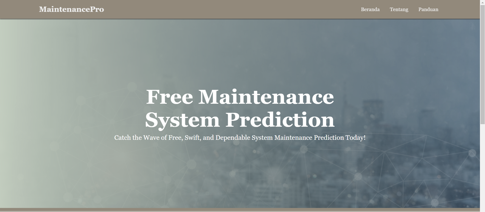

# Final_Project_AI_G1A022014
## Final Project For Artificial Intelligence

Predictive Maintenance System dengan dukungan AI merupakan teknologi yang menawarkan pendekatan yang lebih efisien dan proaktif dalam pemeliharaan peralatan dibandingkan dengan metode tradisional. Sistem ini menekankan kemampuan sistem prediktif untuk menangani masalah yang tidak terduga, serta perannya sebagai mitra yang proaktif dalam pemeliharaan. Berikut Penerapan Predictive Maintenance System: 

## Beranda

Gambar diatas merupakan tampilan dari website sebuah sistem perawatan prediktif berbasis kecerdasan buatan yang disebut "Predictive Maintenance System". Sistem ini menawarkan solusi "Free Maintenance Predictive System" dengan deskripsinya yaitu "Catch the Wave of Free, Swift, and Dependable System Maintenance Prediction Today!". Dapat dilihat dalam tampilan website ini terdapat navigasi utama atau navbar dengan opsi-opsi Beranda, Tentang, dan Panduan.
Penggunaan warna biru dan putih memberikan kesan stabilitas dan keberlanjutan. Sistem ini memanfaatkan sensor untuk pemantauan, serta algoritma machine learning dan kecerdasan buatan untuk analisis data, sistem perawatan prediktif ini dapat memprediksi suatu kegagalan atau kerusakan sebelum hal tersebut terjadi.

## Formulir Prediksi Kerusakan

Gambar diatas merupakan tampilan dari website sistem prediksi perawatan yang memungkinkan pengguna untuk melakukan prediksi potensi kerusakan peralatan. Terdapat sebuah formulir yang meminta pengguna untuk mengunggah gambar yang akan diprediksi oleh sistem. Pengguna dapat memilih gambar dengan mengeklik tombol "Select your picture" atau dengan menarik dan menjatuhkan gambar ke area yang tersedia. Kemudian terdapat tombol "Predict" yang akan memulai proses prediksi kerusakan berdasarkan gambar yang diunggah oleh pengguna.
